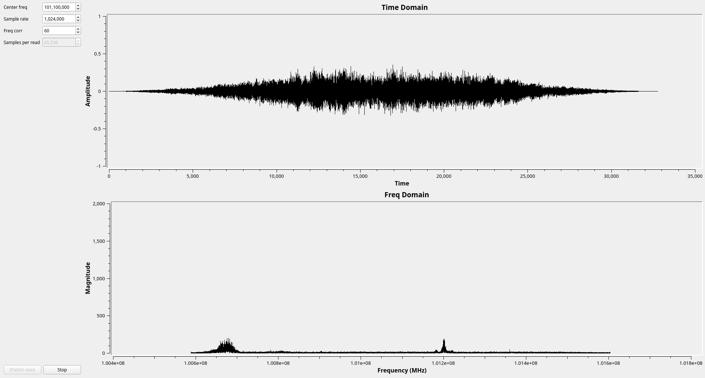

# Visualise Radio

## About

This is an attempt to visualise radio waves by plotting samples captured by an [rtl-sdr](https://www.rtl-sdr.com/). I wanted to do something C++ related while working through [PySDR](https://pysdr.org/), and here it is.

## Building

From project root do `cmake -S . -B build`.
